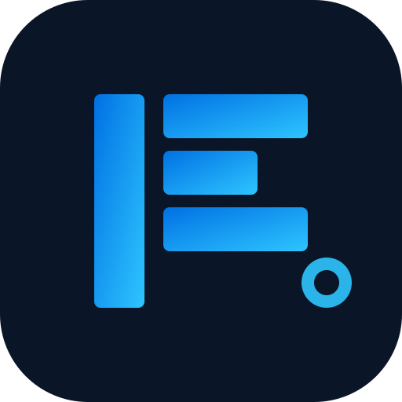

<div align="center">

<picture>
  <source media="(prefers-color-scheme: dark)" srcset="frontend/public/logo.svg">
  <source media="(prefers-color-scheme: light)" srcset="frontend/public/logo.svg">
  
</picture>

# ImageForge

**商业级 AI 图像生产工作空间**

[中文](README.md) | [English](README_EN.md)

[](https://golang.org/)
[](https://vuejs.org/)
[](https://www.typescriptlang.org/)
[](https://tailwindcss.com/)
[](https://www.docker.com/)
[](LICENSE)

---

> 创建、编辑、组织、管理商业化视觉资产，并通过 API 提供能力。

</div>

---

## 📸 界面预览

| 仪表盘 | 画廊 | 生成 |
|:---:|:---:|:---:|
|  |  |  |

> 注：将界面截图保存至 `docs/screenshots/` 目录即可自动展示。

---

## ✨ 核心功能

### 🎨 图像生产
- **AI 图像生成** — 通过 Sub2API 网关集成 Gemini、OpenAI 等供应商
- **图像编辑** — 支持编辑与版本控制的视觉资产管理
- **异步任务队列** — 后台处理与实时状态追踪
- **OpenAI 兼容 API** — 可直接使用 OpenAI SDK 接入

### 🗂 资产管理
- **项目与合集** — 层级化结构组织资产
- **版本控制** — 非破坏性编辑，完整版本历史
- **标签与收藏** — 灵活分类与快速访问
- **提示词模板** — 可复用的生成提示词，支持变量

### 🔐 企业级安全
- **JWT + API Key 认证** — 用户与程序的双认证路径
- **基于角色的访问** — 用户/管理员角色，中间件强制校验
- **资源所有权** — 每次请求服务端验证所有权
- **限流保护** — Redis 支持的分布式限流

### 🚀 生产就绪
- **Docker Compose** — Caddy 自动 HTTPS 一键部署
- **优雅关闭** — 15 秒排空超时，零停机重启
- **健康检查** — 存活探针 + 深度就绪探针 (DB/Redis/存储)
- **自动迁移** — 启动时 schema 自动迁移

---

## 🏗 系统架构

```
┌─────────────────────────────────────────────────────────────┐
│                       浏览器 / 客户端                         │
└──────────────────────────┬──────────────────────────────────┘
                           │ HTTPS
                           ▼
┌──────────────────────────────────────────────────────────────┐
│                    Caddy (80/443, 自动 HTTPS)                  │
│                    反向代理 + 安全响应头                        │
└──────────────────────────┬───────────────────────────────────┘
                           │
                           ▼
┌──────────────────────────────────────────────────────────────┐
│                   ImageForge 后端 (Go + Gin)                  │
│  ┌─────────┐ ┌──────────┐ ┌──────────┐ ┌──────────────────┐ │
│  │  认证   │ │  资产    │ │  生成    │ │   任务队列       │ │
│  │ 服务    │ │  服务    │ │  服务    │ │   处理器         │ │
│  └────┬────┘ └────┬─────┘ └────┬─────┘ └────────┬─────────┘ │
│       │           │            │                │           │
│  ┌────┴───────────┴────────────┴────────────────┴─────────┐ │
│  │                    Ent ORM (PostgreSQL)                 │ │
│  └────────────────────────────────────────────────────────┘ │
└──────────────────────────┬───────────────────────────────────┘
                           │
          ┌────────────────┼────────────────┐
          ▼                ▼                ▼
     ┌─────────┐     ┌─────────┐     ┌──────────┐
     │PostgreSQL│     │  Redis  │     │ R2/MinIO │
     └─────────┘     └─────────┘     └──────────┘
                                             │
                                             ▼
                                    ┌───────────────┐
                                    │   Sub2API     │
                                    │   网关        │
                                    └───────┬───────┘
                                            │
                              ┌─────────────┼─────────────┐
                              ▼             ▼             ▼
                           Gemini       OpenAI        其他
```

---

## 🛠 技术栈

| 层级 | 技术 |
|------|------|
| **后端** | Go 1.26 · Gin · Ent ORM · Viper · Zap |
| **前端** | Vue 3 · Vite · Tailwind CSS 4 · Pinia · Vue Router |
| **数据库** | PostgreSQL 18 · Redis 8 |
| **存储** | Cloudflare R2 · MinIO · S3 兼容 |
| **基础设施** | Docker Compose · Caddy · Let's Encrypt |

---

## 🚀 快速开始

### 环境要求

- [Docker](https://www.docker.com/) 24+ & Docker Compose v2
- [Go](https://golang.org/) 1.26+ (本地开发)
- [Node](https://nodejs.org/) 22+ & pnpm 10+ (本地开发)

### Docker Compose (推荐)

```bash
# 克隆
git clone https://github.com/Aswellle/ImageFactory.git
cd ImageForge

# 配置
cp .env.example .env
# 编辑 .env — 设置 JWT_SECRET, DB_PASSWORD 等

# 启动
docker compose -f deploy/docker-compose.prod.yml up -d

# 验证
curl http://localhost/v1/health
curl http://localhost/v1/health?deep=true
```

### 本地开发

```bash
# 1. 安装前端依赖
make frontend-install

# 2. 配置环境变量
cp .env.example .env

# 3. 启动基础设施
docker compose -f deploy/docker-compose.yml up -d db redis minio

# 4. 运行后端 (终端 1)
cd backend && go run ./cmd/server

# 5. 运行前端 (终端 2)
make frontend-dev
```

然后打开 http://127.0.0.1:5173

---

## 📦 生产部署

```bash
# 1. 克隆
git clone https://github.com/Aswellle/ImageFactory.git && cd ImageForge

# 2. 配置 (必填变量)
cp .env.example .env
#   IF_AUTH_JWT_SECRET    — JWT 签名密钥 (长随机字符串)
#   DB_PASSWORD           — 数据库密码
#   JWT_SECRET            — 同上
#   IF_CADDY_HOST         — 你的域名 (e.g. imageforge.example.com)
#   IF_ALLOWED_ORIGINS    — 前端域名 (e.g. https://imageforge.example.com)
#   STORAGE_SECRET_KEY    — R2/MinIO 密钥

# 3. 部署
docker compose -f deploy/docker-compose.prod.yml up -d

# 4. 验证
curl https://your-domain/v1/health
```

---

## 📡 API 参考

所有端点位于 `/v1` 下，API 与供应商无关。

### 认证

| 方法 | 路径 | 认证 | 说明 |
|------|------|------|------|
| POST | `/v1/auth/register` | — | 创建账户 |
| POST | `/v1/auth/login` | — | 登录 |
| POST | `/v1/auth/send-reset-code` | — | 发送密码重置码 |
| POST | `/v1/auth/reset-password` | — | 重置密码 |
| GET | `/v1/auth/me` | JWT | 当前用户 |

### 图像生成

| 方法 | 路径 | 认证 | 说明 |
|------|------|------|------|
| POST | `/v1/images/generations` | 公开 | OpenAI 兼容生成 |
| POST | `/v1/images/generate` | API Key | 程序化生成 |
| POST | `/v1/images/edits` | JWT | 图像编辑 |
| GET | `/v1/images/jobs` | JWT | 任务列表 |
| GET | `/v1/images/jobs/:id` | JWT | 任务详情 |
| POST | `/v1/images/tasks` | JWT | 提交异步任务 |
| GET | `/v1/images/tasks/:id` | JWT | 查询任务状态 |

### 项目与资产

| 方法 | 路径 | 认证 | 说明 |
|------|------|------|------|
| POST | `/v1/projects` | JWT | 创建项目 |
| GET | `/v1/projects` | JWT | 项目列表 |
| GET | `/v1/projects/:id` | JWT | 项目详情 |
| GET | `/v1/assets` | JWT | 资产列表 |
| GET | `/v1/assets/:id` | JWT | 资产详情 |
| DELETE | `/v1/assets/:id` | JWT | 删除资产 |
| GET | `/v1/assets/:id/content` | JWT | 资产内容 |
| GET | `/v1/assets/:id/versions` | JWT | 版本列表 |

### 提示词模板

| 方法 | 路径 | 认证 | 说明 |
|------|------|------|------|
| POST | `/v1/prompt-templates` | JWT | 创建模板 |
| GET | `/v1/prompt-templates` | JWT | 模板列表 |
| GET | `/v1/prompt-templates/:id` | JWT | 模板详情 |
| PUT | `/v1/prompt-templates/:id` | JWT | 更新模板 |
| DELETE | `/v1/prompt-templates/:id` | JWT | 删除模板 |
| POST | `/v1/prompt-templates/:id/apply` | JWT | 应用模板 |

### API 密钥与用量

| 方法 | 路径 | 认证 | 说明 |
|------|------|------|------|
| POST | `/v1/api-keys` | JWT | 创建密钥 |
| GET | `/v1/api-keys` | JWT | 密钥列表 |
| DELETE | `/v1/api-keys/:id` | JWT | 撤销密钥 |
| GET | `/v1/usage` | JWT | 用量统计 |
| GET | `/v1/usage/history` | JWT | 用量历史 |

### 管理

| 方法 | 路径 | 认证 | 说明 |
|------|------|------|------|
| GET | `/v1/admin/dashboard` | 管理员 | 仪表盘数据 |
| GET | `/v1/admin/users` | 管理员 | 用户列表 |
| GET | `/v1/admin/jobs` | 管理员 | 任务管理 |
| GET | `/v1/admin/api-keys` | 管理员 | 密钥管理 |

---

## ⚙️ 配置

所有配置通过环境变量驱动，统一使用 `IF_` 前缀。

| 变量 | 默认值 | 说明 |
|------|--------|------|
| `IF_SERVER_HOST` | `0.0.0.0` | 监听地址 |
| `IF_SERVER_PORT` | `8080` | 监听端口 |
| `IF_SERVER_MODE` | `release` | 运行模式 (debug/release) |
| `IF_SERVER_ALLOWED_ORIGINS` | — | CORS 来源 (逗号分隔) |
| `IF_SERVER_TRUSTED_PROXIES` | 私有 CIDRs | 可信代理网段 |
| `IF_DATABASE_HOST` | `localhost` | 数据库地址 |
| `IF_DATABASE_AUTO_MIGRATE` | `true` | 自动迁移 |
| `IF_AUTH_JWT_SECRET` | — | **JWT 密钥 (必填)** |
| `IF_STORAGE_PROVIDER` | `filesystem` | 存储类型 (r2/minio/filesystem) |
| `IF_FORCE_HTTPS` | `false` | 强制 HTTPS |
| `IF_CADDY_HOST` | — | 公网域名 |

完整列表见 `.env.example`。

---

## 📁 项目结构

```
ImageForge/
├── backend/                    # Go API 服务器
│   ├── cmd/
│   │   ├── server/             # 主入口 + DI wiring
│   │   └── admin-cli/          # 管理员 CLI 工具
│   ├── ent/                    # Ent ORM 生成代码
│   │   ├── schema/             # 实体 schema 定义
│   │   └── *.go                # 生成代码
│   ├── internal/
│   │   ├── config/             # Viper 配置加载
│   │   ├── server/             # 路由器 + Gin 中间件
│   │   ├── handler/            # HTTP 处理器
│   │   ├── service/            # 业务逻辑层
│   │   ├── repository/         # 数据访问层
│   │   ├── job/                # 异步任务队列
│   │   ├── batchimage/         # 批量图像管线
│   │   ├── storage/            # 对象存储抽象
│   │   ├── domain/             # 领域常量
│   │   └── pkg/                # errors, logger, response
│   └── migrations/             # SQL 迁移脚本
├── frontend/                   # Vue 3 SPA
│   ├── src/
│   │   ├── api/                # Axios 客户端 + 模块
│   │   ├── views/              # 页面组件
│   │   ├── components/         # 通用 UI 组件
│   │   ├── stores/             # Pinia 状态管理
│   │   ├── router/             # 路由配置
│   │   ├── i18n/               # 国际化 (en/zh)
│   │   ├── styles/             # Tailwind 样式
│   │   └── types/              # TypeScript 类型
│   └── public/                 # 静态资源 + Logo
├── deploy/
│   ├── docker-compose.yml      # 开发环境
│   ├── docker-compose.prod.yml # 生产环境
│   └── Caddyfile               # Caddy 反向代理配置
├── tests/                      # Playwright 端到端测试
├── Dockerfile                  # 多阶段构建
├── Makefile                    # 开发快捷命令
└── docs/                       # PRD、工程规范、截图
```

---

## 🤝 贡献

欢迎贡献代码！提交 PR 前请阅读工程规范。

```bash
# Fork 并克隆
git clone https://github.com/Aswellle/ImageFactory.git

# 创建分支
git checkout -b feat/your-feature

# 提交
git commit -m "feat(module): 添加新功能"

# 推送并创建 PR
git push origin feat/your-feature
```

---

## 📄 开源协议

本项目基于 [Apache License 2.0](LICENSE) 协议开源。

---

## 🙏 致谢

- [Sub2API](https://github.com/Wei-Shaw/sub2api) — 上游 AI 网关基础设施
- [Ent](https://entgo.io/) — Go 的实体关系映射
- [Gin](https://gin-gonic.com/) — HTTP Web 框架
- [Vue.js](https://vuejs.org/) — 渐进式 JavaScript 框架

---

<div align="center">

**[⬆ 返回顶部](#imageforge)**

Made with ❤️ by the ImageForge Team

</div>
